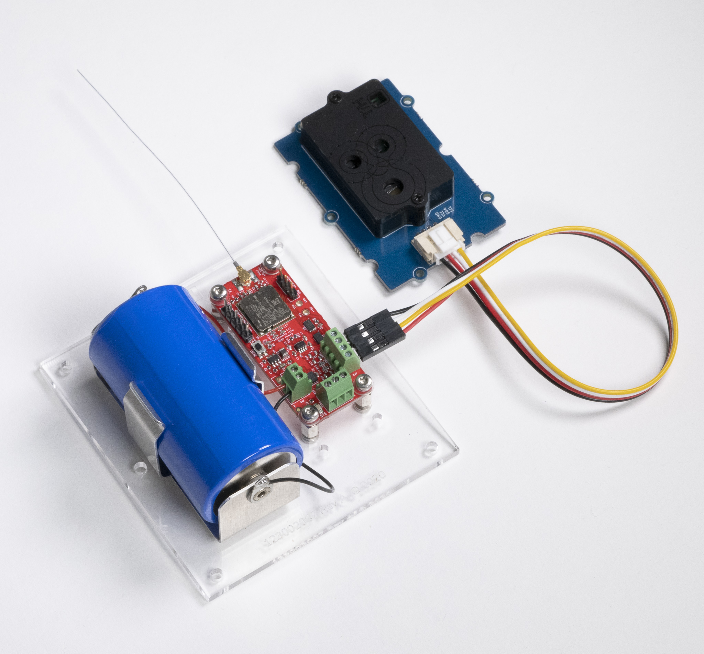
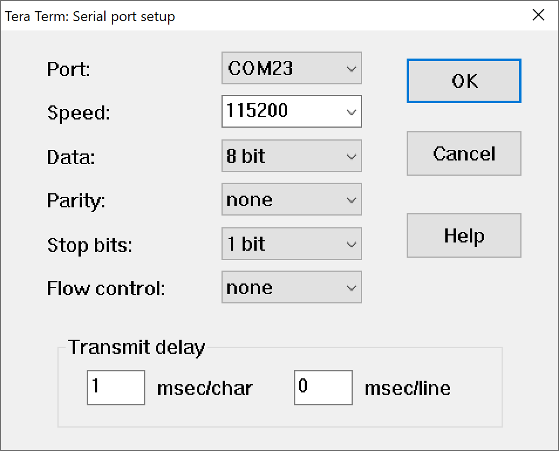

# SCD30 LoRaWAN&reg; Example Sketch

The sketch in this directory (found [here](https://github.com/mcci-catena/MCCI_Catena_SCD30/examples/scd30_lorawan) on GitHub) is a fully-worked example of how to capture data from an SCD30 carbon dioxide (CO2) sensor, and transmit it via LoRaWAN. It requires the [MCCI_Catena_Arduino_Platform](https://github.mcci.com/mcci-catena/Catena-Arduino-Platform) library.

Here's a picture of our reference setup, the MCCI [Eval Kit for the SCD30](http://mcci.io/eval-4801m301-scd30).

<!-- TOC depthFrom:2 updateOnSave:true -->

- [Serial Port Commands](#serial-port-commands)
	- [`debugflags`](#debugflags)
	- [`run`](#run)
	- [`stop`](#stop)
	- [`system configure operatingflags`](#system-configure-operatingflags)
- [Data Format](#data-format)
- [Provisioning](#provisioning)
- [Setup for Development and Provisioning](#setup-for-development-and-provisioning)
- [Meta](#meta)
	- [Support Open Source Hardware and Software](#support-open-source-hardware-and-software)
	- [Trademarks](#trademarks)

<!-- /TOC -->

## Serial Port Commands

The sketch responds to commands from the serial port. In addition to the commands that are part of the Catena-Arduino-Platform, the sketch also has the following commands.

### `debugflags`

This command prints or changes the debug flag mask. If entered without arguments, it displays the current flags. If entered with arguments, it changes the debug flags. The flags are a 32-bit word, and may be entered in decimal, hexadecimal (with a `0x` prefix), or octal (with a `0` prefix).  The defined bits are:

Bit |  Mask | Name | Meaning
:--:|:-----:|------|---------
  0 |  `0x01` | `kBug` | Error messages displayed for bugs
  1 |  `0x02` | `kError` | Error messages displayed for runtime errors
  2 |  `0x04` | `kWarning` | Runtime warnings
  3 |  `0x08` | `kTrace` | Messages tracing changes of state, e.g. FSM transitions.
  4 |  `0x10` | `kInfo` | Informational messages.
5..31 | `0xFFFFFFE0` | N/A | Not used.

### `run`

This command starts the measure/transmit loop. It is automatically started on bootup if the LoRaWAN system is configured. Otherwise, the measure/transmit loop will remain in an idle state.

### `stop`

This command stops the measure/transmit loop. Interactive commands can still be entered.

### `system configure operatingflags`

This command is used to set the system operating flags in FRAM. This application only uses bit 0. If bit zero is set, it enables "stand-alone mode". In this mode, the device uses deep sleeps in between transmissions. While sleeping, the serial port is disabled.

If bit zero is clear, the device is in "development mode". In this mode, the device stays partially awake between transmissions, and will respond to the serial port. This mode takes more power, but is more convenient during development.

## Data Format

The device transmits data on port 1, and uses the first byte as a format discriminator. The byte is `0x1E`.  See [`message-port1-format-1E.md1](extra/message-port1-format-1e.md) for details; decoders can also be found in that directory.

## Provisioning

Because this library uses the standard Catena-Arduino-Platform library, the Catena 4801 is provisioned via the serial port using the standard procedures used for all MCCI devices.

See [How to Provision Your Catena Device](https://github.com/mcci-catena/Catena-Sketches/blob/master/extra/How-To-Provision-Your-Catena-Device.md) and [Getting Started with The Things Network](https://github.com/mcci-catena/Catena-Sketches/blob/master/extra/Getting-Started-With-The-Things-Network.md) for more information.

This photo may help with hooking up the serial port and an STLINK:

## Setup for Development and Provisioning

1. Attach an ST-LINK-2 to the SWD pins of the 4801 using jumpers.

   .

   | 4801 Pin |  Label | ST-Link Pin | Jumper Color
   |:--------:|:------:|:-----------:|---------------
   |   JP1-1  |  +VDD  |      1      | Red
   |   JP1-2  |   GND  |      3      | Black
   |   JP1-3  | SWDCLK |      9      | Brown
   |   JP1-4  | SWDIO  |      7      | Orange
   |   JP1-5  |  nRST  |     15      | Yellow

2. Attach a Raspberry Pi 3-pin USB to TTL serial adapter.

   | 4801 Pin |  Label |    Pi 3-Wire Color
   |:--------:|:------:|:------------------------
   |   JP4-1  |  GND   |     Black
   |   JP4-2  |   D0   |     Orange
   |   JP4-3  |   D1   |     Yellow

3. Connect the serial adapter to PC via USB.  Ensure (in device manager) that the FTDI driver is creating a COM port.

4. Use TeraTerm and open the COM port. In `Setup>Serial`, set speed to 115200, and set transmit delay to 1.

   

   If you see instructions to set local echo on, or change line ending, you can ignore them -- they're no longer needed with recent versions of the Catena Arduino Platform.

From here, you should be able to use the IDE to download code, and use the standard provisioning procedures to provision your device.

## Meta

### Support Open Source Hardware and Software

MCCI invests time and resources providing this open source code, please support MCCI and open-source hardware by purchasing products from MCCI, Adafruit and other open-source hardware/software vendors!

For information about MCCI's products, please visit [store.mcci.com](https://store.mcci.com/).

### Trademarks

MCCI and MCCI Catena are registered trademarks of MCCI Corporation. LoRaWAN is a registered trademark of the LoRa Alliance. All other marks are the property of their respective owners.
