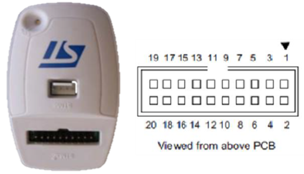

# SCD30 Simple Example Sketch

The sketch in this directory (found [here](https://github.com/mcci-catena/MCCI_Catena_SCD30/examples/scd30_simple) on GitHub) is a very simple demo of how to capture data from a Sensirion SCD30 sensor and print it on the serial port. It requires no additional libraries.

<!-- TOC depthFrom:2 updateOnSave:true -->

- [Setting up the sketch](#setting-up-the-sketch)
- [What to expect](#what-to-expect)
- [Setup for Development](#setup-for-development)
- [Meta](#meta)
	- [Support Open Source Hardware and Software](#support-open-source-hardware-and-software)
	- [Trademarks](#trademarks)

<!-- /TOC -->

## Setting up the sketch

The sketch sets the serial port to 115k baud.

It uses the newer Arduino BSP convention of polling `Serial` to wait for a USB serial port to be connected. Your BSP might not support it; if so, comment it out.

```c+++
// wait for USB to be attached.
while (! Serial)
    yield();
```

## What to expect

The sketch reads and displays the temperature, humidity, and CO2 ppm every two seconds. You should see something like this.

```log
SDP Simple Test
Reset reason: 14
Found sensor: firmware version 3.66.
  Automatic Sensor Calibration: 1
  Sample interval:              2 secs
  Forced Recalibration:         400 ppm
  Temperature Offset(delta-F):  0.00
  Altitude (meters):            0
T(F)=75.15  Humidity=38.77%  Dewpoint(F)=48.34  CO2 concentration=0.00 ppm
T(F)=75.10  Humidity=38.78%  Dewpoint(F)=48.30  CO2 concentration=232.53 ppm
T(F)=75.10  Humidity=38.82%  Dewpoint(F)=48.33  CO2 concentration=347.85 ppm
T(F)=75.10  Humidity=38.83%  Dewpoint(F)=48.34  CO2 concentration=403.31 ppm
T(F)=75.05  Humidity=38.88%  Dewpoint(F)=48.33  CO2 concentration=414.67 ppm
T(F)=75.10  Humidity=38.89%  Dewpoint(F)=48.38  CO2 concentration=402.52 ppm
T(F)=75.02  Humidity=38.88%  Dewpoint(F)=48.30  CO2 concentration=402.08 ppm
T(F)=75.07  Humidity=38.89%  Dewpoint(F)=48.36  CO2 concentration=401.25 ppm
T(F)=75.02  Humidity=38.90%  Dewpoint(F)=48.32  CO2 concentration=402.54 ppm
T(F)=75.02  Humidity=38.89%  Dewpoint(F)=48.31  CO2 concentration=404.01 ppm
```

The first reading after power up is
Here's an example of blowing gently on the sensor (with mouth wide for slow airflow):

```log
T(F)=75.05  Humidity=39.33%  Dewpoint(F)=48.64  CO2 concentration=482.55 ppm
T(F)=75.05  Humidity=39.33%  Dewpoint(F)=48.64  CO2 concentration=483.19 ppm
T(F)=75.10  Humidity=40.30%  Dewpoint(F)=49.33  CO2 concentration=544.61 ppm
T(F)=75.07  Humidity=44.05%  Dewpoint(F)=51.71  CO2 concentration=629.69 ppm
T(F)=75.02  Humidity=45.61%  Dewpoint(F)=52.61  CO2 concentration=731.63 ppm
T(F)=75.07  Humidity=44.19%  Dewpoint(F)=51.80  CO2 concentration=873.16 ppm
T(F)=75.05  Humidity=43.05%  Dewpoint(F)=51.07  CO2 concentration=1192.40 ppm
T(F)=75.02  Humidity=42.13%  Dewpoint(F)=50.46  CO2 concentration=1921.59 ppm
T(F)=75.05  Humidity=41.51%  Dewpoint(F)=50.09  CO2 concentration=2674.78 ppm
T(F)=75.07  Humidity=41.07%  Dewpoint(F)=49.82  CO2 concentration=2717.48 ppm
T(F)=75.05  Humidity=40.81%  Dewpoint(F)=49.63  CO2 concentration=2629.32 ppm
T(F)=75.05  Humidity=40.61%  Dewpoint(F)=49.49  CO2 concentration=2506.56 ppm
T(F)=75.05  Humidity=40.46%  Dewpoint(F)=49.40  CO2 concentration=2427.85 ppm
T(F)=75.05  Humidity=40.32%  Dewpoint(F)=49.31  CO2 concentration=2287.11 ppm
T(F)=75.05  Humidity=40.21%  Dewpoint(F)=49.23  CO2 concentration=2150.49 ppm
T(F)=75.02  Humidity=40.13%  Dewpoint(F)=49.15  CO2 concentration=2014.11 ppm
T(F)=75.05  Humidity=40.00%  Dewpoint(F)=49.09  CO2 concentration=1939.72 ppm
T(F)=75.02  Humidity=39.93%  Dewpoint(F)=49.02  CO2 concentration=1826.55 ppm
T(F)=75.05  Humidity=39.92%  Dewpoint(F)=49.04  CO2 concentration=1661.44 ppm
T(F)=75.05  Humidity=39.88%  Dewpoint(F)=49.01  CO2 concentration=1595.87 ppm
```

Note that the humidity goes up modestly, but the CO2 ppm goes way up. A person's breath is about 4000 ppm CO2, and is warmer and more humid than ambient. The CO2 takes a while to diffuse back to ambient levels. Some of this is sensor response time;

If measuring continuously with this program, you may see self-heating in the sensor (i.e., the temperature may be higher than ambient).

## Setup for Development

1. Attach an ST-LINK-2 to the SWD pins of the 4801 using jumpers.

   .

   | 4801 Pin |  Label | ST-Link Pin | Jumper Color
   |:--------:|:------:|:-----------:|---------------
   |   JP1-1  |  +VDD  |      1      | Red
   |   JP1-2  |   GND  |      3      | Black
   |   JP1-3  | SWDCLK |      9      | Brown
   |   JP1-4  | SWDIO  |      7      | Orange
   |   JP1-5  |  nRST  |     15      | Yellow

2. Attach a Raspberry Pi 3-pin USB to TTL serial adapter.

   | 4801 Pin |  Label |    Pi 3-Wire Color
   |:--------:|:------:|:------------------------
   |   JP4-1  |  GND   |     Black
   |   JP4-2  |   D0   |     Orange
   |   JP4-3  |   D1   |     Yellow

3. Connect the serial adapter to PC via USB.  Ensure (in device manager) that the FTDI driver is creating a COM port.

4. Use TeraTerm and open the COM port. In `Setup>Serial`, set speed to 115200, and set transmit delay to 1.

   

   If you see instructions to set local echo on, or change line ending, you can ignore them -- they're no longer needed with recent versions of the Catena Arduino Platform.

## Meta

### Support Open Source Hardware and Software

MCCI invests time and resources providing this open source code, please support MCCI and open-source hardware by purchasing products from MCCI, Adafruit and other open-source hardware/software vendors!

For information about MCCI's products, please visit [store.mcci.com](https://store.mcci.com/).

### Trademarks

MCCI and MCCI Catena are registered trademarks of MCCI Corporation. All other marks are the property of their respective owners.
